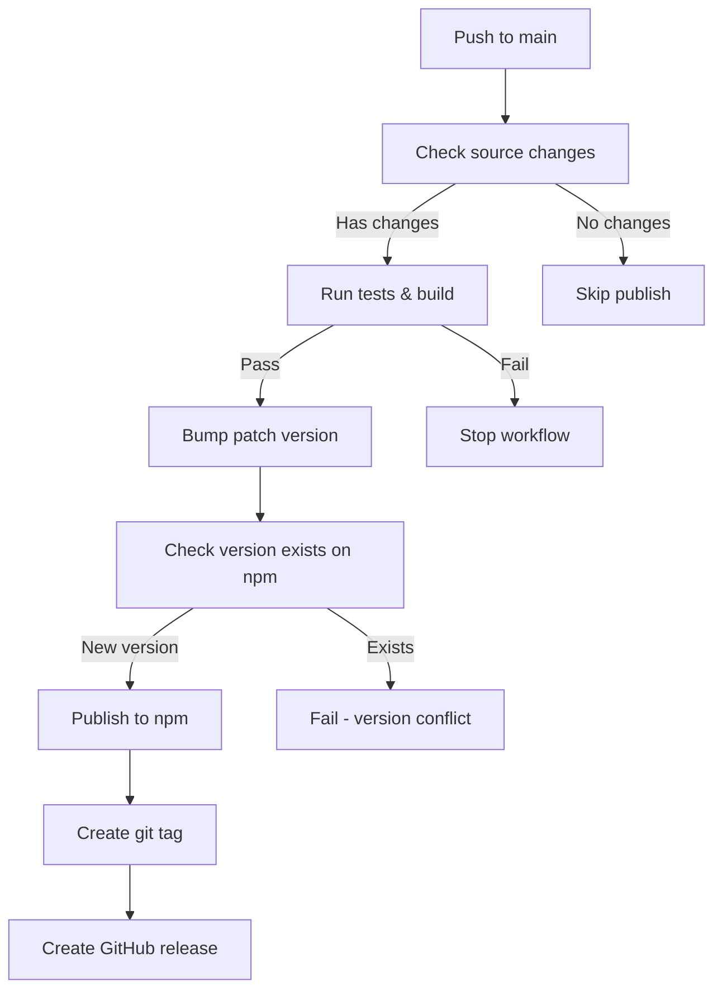

# Auto Publishing Workflow

Dự án này được thiết lập để tự động publish lên npm khi push code mới. Workflow sẽ kiểm tra code quality, build, test và chỉ publish khi tất cả đều pass.

## 🚀 Cách thức hoạt động

### Tự động publish khi push vào main branch:
1. Kiểm tra TypeScript và lint
2. Build package 
3. Chạy tests (nếu có)
4. Kiểm tra có thay đổi trong source code không
5. Nếu có thay đổi → auto bump patch version và publish
6. Tạo git tag và GitHub release

### Manual publish:
- Vào GitHub Actions → "Auto Publish to npm" → "Run workflow"
- Chọn version type hoặc nhập version cụ thể
- Có thể chạy dry-run để test

## 🔧 Setup ban đầu

### 1. Thiết lập NPM Token:
```bash
npm run setup:secrets
```

### 2. GitHub Repository Settings:
- Settings → Actions → General
- Workflow permissions: "Read and write permissions"
- ✅ "Allow GitHub Actions to create and approve pull requests"

### 3. Thêm NPM_TOKEN secret:
- GitHub repo → Settings → Secrets and variables → Actions
- New secret: `NPM_TOKEN` với token từ npmjs.com

## 📦 Các lệnh version management

### Kiểm tra status hiện tại:
```bash
npm run version:status
```

### Bump version:
```bash
npm run version:bump:patch    # 1.0.0 → 1.0.1
npm run version:bump:minor    # 1.0.0 → 1.1.0  
npm run version:bump:major    # 1.0.0 → 2.0.0
```

### Set version cụ thể:
```bash
npm run version:set 1.2.3
```

### Publish manual:
```bash
npm run publish:dry          # Test publish
npm run publish:manual       # Publish thật
```

### Full release process:
```bash
npm run release:patch        # Bump patch + build + publish
npm run release:minor        # Bump minor + build + publish
npm run release:major        # Bump major + build + publish
```

## 🔄 Workflow Events

### 1. Push to main branch:
- Chỉ publish khi có thay đổi trong: `src/`, `package.json`, `index.ts/js`
- Auto bump patch version
- Tạo git tag và GitHub release

### 2. Manual dispatch:
- Có thể chọn version type: patch/minor/major/prerelease
- Hoặc nhập version cụ thể
- Có option dry-run để test

### 3. GitHub Release:
- Trigger khi tạo release manual
- Sử dụng version từ release tag

## 📋 Flow chi tiết



## 🛡️ Safeguards

- ✅ TypeScript type checking
- ✅ ESLint validation  
- ✅ Build verification
- ✅ Test execution
- ✅ Version conflict detection
- ✅ Clean working directory check
- ✅ Source change detection
- ✅ NPM token validation

## 📝 Logs và Debug

### Xem workflow logs:
- GitHub → Actions → Chọn workflow run
- Click vào job để xem chi tiết

### Local debugging:
```bash
# Check status
npm run version:status

# Test build
npm run build

# Test publish dry-run
npm run publish:dry
```

## 🔧 Troubleshooting

### Workflow không chạy:
1. Check GitHub repo settings cho Actions permissions
2. Verify NPM_TOKEN secret exists
3. Check workflow file syntax

### Publish fail:
1. Check NPM token còn valid
2. Verify package name chưa bị taken
3. Check version không bị duplicate

### Version conflict:
1. Manual bump version: `npm run version:bump:patch`
2. Push changes trước khi publish

## 🎯 Best Practices

1. **Commit changes trước khi release manual**
2. **Dùng semantic versioning**
3. **Test với dry-run trước khi publish**
4. **Check NPM package page sau khi publish**
5. **Monitor GitHub Actions cho errors**

## 📞 Support

Nếu có vấn đề với workflow:
1. Check GitHub Actions logs
2. Run local commands để debug
3. Verify all secrets và permissions
4. Check package.json cho script errors